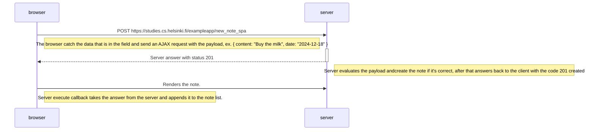

```mermaid
sequenceDiagram
    participant browser
    participant server

    browser->>server: POST https://studies.cs.helsinki.fi/exampleapp/new_note_spa
    Note right of browser: The browser catch the data that is in the field and send an AJAX request with the payload, ex. { content: "Buy the milk", date: "2024-12-18" }
    activate server

    server-->>browser: Server answer with status 201
    deactivate server
    Note right of server: Server evaluates the payload andcreate the note if it's correct, after that answers back to the client with the code 201 created

    browser->>server: Renders the note.
    Note right of browser: Server execute callback takes the answer from the server and appends it to the note list.

```
